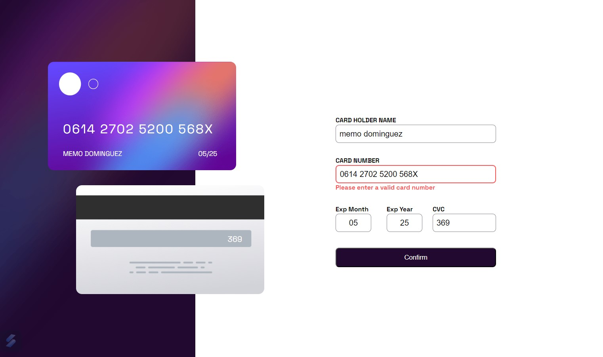

# Frontend Mentor - Interactive card details form solution

This is a solution to the [Interactive card details form challenge on Frontend Mentor](https://www.frontendmentor.io/challenges/interactive-card-details-form-XpS8cKZDWw). Frontend Mentor challenges help you improve your coding skills by building realistic projects. 

## Table of contents

- [Overview](#overview)
  - [The challenge](#the-challenge)
  - [Screenshot](#screenshot)
  - [Links](#links)
- [My process](#my-process)
  - [Built with](#built-with)
  - [What I learned](#what-i-learned)
  - [Continued development](#continued-development)
  - [Useful resources](#useful-resources)
- [Author](#author)
- [Acknowledgments](#acknowledgments)

**Note: Delete this note and update the table of contents based on what sections you keep.**

## Overview

### The challenge

Users should be able to:

- Fill in the form and see the card details update in real-time
- Receive error messages when the form is submitted if:
  - Any input field is empty
  - The card number, expiry date, or CVC fields are in the wrong format
- View the optimal layout depending on their device's screen size
- See hover, active, and focus states for interactive elements on the page

### Screenshot




### Links

- Solution URL: Pending
- Live Site URL: Pending

## My process

### Built with

- Semantic HTML5 markup
- CSS custom properties
- Flexbox
- CSS Grid
- Mobile-first workflow
- [React](https://reactjs.org/) - JS library
- [Vite](https://vitejs.dev/) - Development server
- [cleave.js](https://www.npmjs.com/package/cleave.js?activeTab=readme) - HTML input formatter


### What I learned

Another experience about html form processing / validation.

Particular challenge was de credit card number input formatting and validation.

The code snippets below are for credit card input validation

```js
    // Validate card number
    let trimNum = enteredValues.cardNum.trim()
    let numNospaces = enteredValues.cardNum.replace(/\s+/g, "");
    let numValid = isStringAllNumbers(numNospaces);
    if (trimNum.length < 16 || numValid === false) {
        validationErrors.cardNum = "Please enter a valid card number";
    }   
```
Got this snippet thanks to chatGPT 
```js
// To validate card number. Check that all are numbers
  function isStringAllNumbers(str) {
    for (let i = 0; i < str.length; i++) {
      if (isNaN(parseInt(str[i]))) {
        return false;
      }
    }
    return true;
  }
```


### Continued development


Continue improving my coding skills by developing challenging applications, like this one.


### Useful resources

- [Cleave.js demo](https://www.youtube.com/watch?v=9o-jdy2Ar6M) - From here I learned the application of this library for input formatting.
- [Form validation in React JS](https://www.youtube.com/watch?v=yra7iNwAjL4) - It shows a way to validate every single input from a form.

- [ChatGPT](https://chat.openai.com/) - Made miscellaneous consultations. The answers are often useful.

- As always, w3schools.com and developer.mozilla.org are very useful resources.

## Author


- Website - [Guillermo Dominguez](https://gdominguez-portfolio.netlify.app)
- Frontend Mentor - [@memominguez](https://www.frontendmentor.io/profile/memominguez)


## Acknowledgments


Thanks to all those who share their knowledge, free of charge, through video tutorials in the youtube platform.
 
